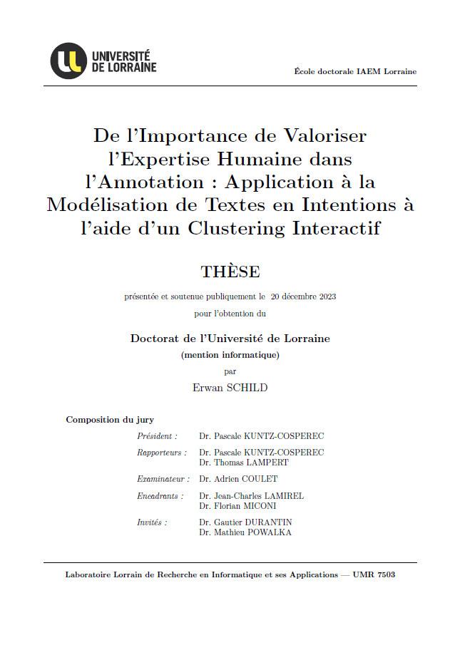

# interactive-clustering-phd-report
Erwan SCHILD PHD report on Interactive Clustering methodology.

<p align="center">
  
</p>

## Description

Title: `De l'Importance de Valoriser l'Expertise Humaine dans l'Annotation : Application à la Modélisation de Textes en Intentions à l'aide d'un Clustering Interactif`

### Installation

- `MikTeX`: https://miktex.org/
- `TeXMaker`: https://www.xm1math.net/texmaker/

### Packages LaTeX

- morewrites
- babel-french

### Compilation

Pour configurer `TeXMaker` (`Options` > `Configurer Texmaker` > `Compil rapide` > `utilisateur`) :
```TeXMaker
pdflatex -interaction=nonstopmode -synctex=1 % | biber % | makeindex %.idx | makeglossaries % | pdflatex -interaction=nonstopmode -synctex=1 % | pdflatex -interaction=nonstopmode -synctex=1 % | "C:/Program Files (x86)/Adobe/Acrobat Reader DC/Reader/AcroRd32.exe" %.pdf
```
- _Notes_: `%` représente le nom du fichier sans extension.
