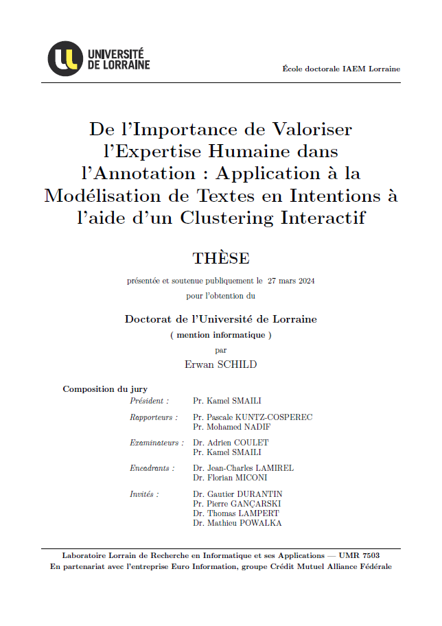

# interactive-clustering-phd-report

<p align="center">
	<a href="https://github.com/erwanschild/interactive-clustering-phd-report/releases/download/1.0.5/phd_report_1.0.5.pdf">TELECHARGER LE PDF (v1.0.5)</a>
</p>


## Description de la thèse

**Titre** :

> De l'Importance de Valoriser l'Expertise Humaine dans l'Annotation :
> Application à la Modélisation de Textes en Intentions à l'aide d'un Clustering Interactif

**Auteur** :

> Erwan SCHILD <[erwan.schild@e-i.com](mailto:erwan.schild@e-i.com)>

**Résumé / Abstract** :

> La tâche d'annotation, nécessaire à l'entraînement d'assistants conversationnels, fait habituellement appel à des experts du domaine à modéliser. Toutefois, l'annotation de données est connue pour être une tâche difficile en raison de sa complexité et sa subjectivité : elle nécessite par conséquent de solides compétences analytiques dans le but de modéliser les textes en intention de dialogue. De ce fait, la plupart des projets d'annotation choisissent de former les experts aux tâches d'analyse pour en faire des "super-experts".
> Dans cette thèse, nous avons plutôt décidé mettre l’accent sur les connaissances réelles des experts en proposant une nouvelle méthode d'annotation basée sur un Clustering Interactif. Celle-ci se base sur une coopération Homme/Machine, où la machine réalise un clustering pour proposer une base initiale d'apprentissage, et où l'expert annote des contraintes MUST-LINK ou CANNOT-LINK entre les données pour affiner itérativement la base d'apprentissage proposée. Une telle annotation présente l'avantage d'être plus instinctive, car les experts peuvent associer ou différencier les données en fonction de la similarité de leur cas d'usage, permettant ainsi de traiter les données comme ils le feraient professionnellement au quotidien.
> Au cours de nos études, nous avons pu montrer que cette méthode diminuait sensiblement la complexité de conception d'une base d'apprentissage, réduisant notamment la nécessité de formation des experts intervenant dans un projet d'annotation. Nous proposons une implémentation technique de cette méthode (algorithmes et interface graphique associée), ainsi qu'une étude des paramètres optimaux pour obtenir une base d'apprentissage cohérente en un minimum d'annotation. Nous réalisons également une étude de coûts (techniques et humains) permettant de confirmer que l'utilisation d'une telle méthode est réaliste dans un cadre industriel. De plus, afin que la méthode atteigne son plein potentiel, nous fournissons un ensemble de conseils, notamment : (1) des recommandations visant à cadrer la stratégie d’annotation, (2) une aide à l'identification et à la résolution des divergences d'opinion entre annotateurs, (3) des indicateurs de rentabilité pour chaque intervention de l'expert, et (4) des méthodes d'analyse de la pertinence de la base d'apprentissage en cours de construction.
> En conclusion, cette thèse offre une approche innovante pour concevoir une base d'apprentissage d'un assistant conversationnel, permettant d'impliquer les experts du domaine métier pour leurs vraies connaissances, tout en leur demandant un minimum de compétences analytiques et techniques. Ces travaux ouvrent ainsi la voie à des méthodes plus accessibles pour la construction de ces assistants.

**How to cite** :
> Schild, E. (2024, in press). De l'Importance de Valoriser l'Expertise Humaine dans l’Annotation : Application à la Modélisation de Textes en Intentions à l'aide d’un Clustering Interactif. Université de Lorraine.

<p align="center">
	<a href="https://github.com/erwanschild/interactive-clustering-phd-report/releases/download/1.0.5/phd_report_1.0.5.pdf">
		
	</a>
</p>

## Travaux associés

**Première publication scientifique à la conférence _EGC 2021_** :

> Schild, E., Durantin, G., Lamirel, J.C., & Miconi, F. (2021). Conception itérative et semi-supervisée d'assistants conversationnels par regroupement interactif des questions. In EGC 2021 - 21èmes Journées Francophones Extraction et Gestion des Connaissances. Edition RNTI. https://hal.science/hal-03133007.

**Extension de la publication dans le journal _IJDWM 2022_** : *(publication de référence)*

> Schild, E., Durantin, G., Lamirel, J., & Miconi, F. (2022). Iterative and Semi-Supervised Design of Chatbots Using Interactive Clustering. International Journal of Data Warehousing and Mining (IJDWM), 18(2), 1-19. http://doi.org/10.4018/IJDWM.298007. https://hal.science/hal-03648041.

**Discussion méthodologique dans l'atelier _TextMine 2021 (EGC)_** :

> Schild, E., Durantin, G., & Lamirel, J.C. (2021). Concevoir un assistant conversationnel de manière itérative et semi-supervisée avec le clustering interactif. In Atelier - Fouille de Textes - Text Mine 2021 - En conjonction avec EGC 2021. https://hal.science/hal-03133060.

**Application web implémentant notre Clustering Interactif** :

> Schild, E. (2021). cognitivefactory/interactive-clustering-gui. Zenodo. https://doi.org/10.5281/zenodo.4775270.
> (GitHub: [cognitivefactory/interactive-clustering-gui](https://github.com/cognitivefactory/interactive-clustering-gui)).
>
> <p align="center">
>	<a href="https://github.com/cognitivefactory/interactive-clustering-gui">
>		<i style="font-size: smaller; color:grey">Welcome page of Interactive Clustering Web Application.</i>
>		</br>
>		
>	</a>
> </p>

**Protocoles expérimentaux des études réalisées** :

> Schild, E. (2021). cognitivefactory/interactive-clustering-comparative-study. Zenodo. https://doi.org/10.5281/zenodo.5648255.
> (GitHub: [cognitivefactory/interactive-clustering-comparative-study](https://github.com/cognitivefactory/interactive-clustering-comparative-study)).
> 
> <p align="center">
> 	<a href="https://github.com/cognitivefactory/interactive-clustering-comparative-study">
>		<i style="font-size: smaller; color:grey">Organizational diagram of the different Comparative Studies of Interactive Clustering.</i>
>		</br>
>		
>	</a>
> </p>

## Compilation du code LaTeX de ce manuscrit

Pour compiler le code `LaTeX`, suivez les instructions suivantes.

1. Installer les logiciels suivants :
	- `MikTeX`: https://miktex.org/
	- `TeXMaker`: https://www.xm1math.net/texmaker/

2. Installer les dépendances `LaTeX` suivantes avec `MikTeX` :
	- `morewrites`
	- `babel-french`

3. Compiler le code `LaTeX` avec `TeXMaker` grâce aux commandes suivantes :
	- Gestion des paramétrage dans `Options` > `Configurer Texmaker` > `Compil rapide` > `utilisateur`.
	- `%` représente le nom du fichier sans extension.

	```TeXMaker
	pdflatex -interaction=nonstopmode -synctex=1 % | biber % | makeindex %.idx | makeglossaries % | pdflatex -interaction=nonstopmode -synctex=1 % | pdflatex -interaction=nonstopmode -synctex=1 % | "C:/Program Files (x86)/Adobe/Acrobat Reader DC/Reader/AcroRd32.exe" %.pdf
	```